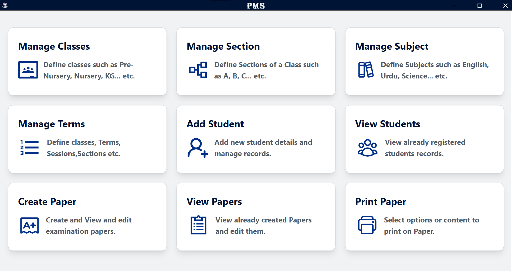
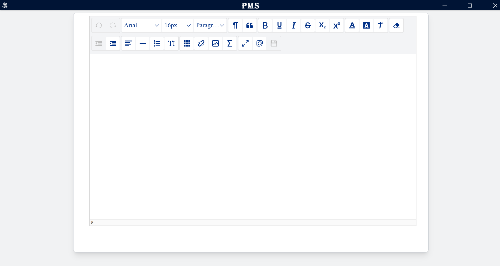
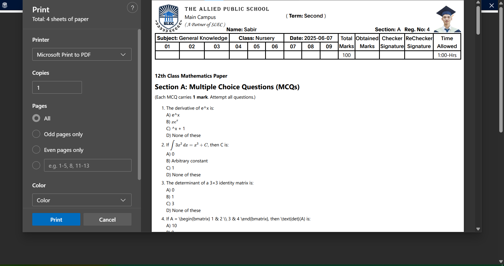

# 📄 Electron-based Paper Management System

An all-in-one offline solution for managing student records and dynamically generating, formatting, and printing personalized examination papers. This system brings together the simplicity of Microsoft Word-style editing with robust student and exam data management.

📧 For installation inquiries or enterprise deployment, contact us at: info@devtros.com

---

## 🚀 Key Features

### 🧑‍🎓 Student & Class Data Management

- Manage Classes:
  - Create, edit, or delete classes (e.g., Class 1, Class 2, etc.)
- Sections:
  - Define and organize sections within each class (e.g., A, B, C)
- Students:
  - Enroll students with details including:
    - Full Name
    - Roll Number
    - Parent/Guardian Info
    - Class & Section
    - Contact Details
- Grades:
  - Design and assign grading systems for assessments

---

### ✍️ Paper Composition Tool

- WYSIWYG Editor:
  - Rich text editor with features similar to Microsoft Word
- Supports:
  - Text formatting, tables, images, mathematical equations & symbols
- Templates:
  - Built-in exam formats: MCQs, Short Answer, Long Answer, etc.
- Dynamic Headers/Footers:
  - Auto-populate fields like Student Name, Class, Date, etc.

---

### 📚 Question Bank Integration

- Organize Questions:
  - Store and categorize by subject, type, and difficulty
- Smart Filtering:
  - Retrieve and reuse questions based on filters for quick paper generation

---

### 🎨 Paper Customization

- Structure:
  - Define paper layout, sections, and mark distributions
- Visual Enhancements:
  - Add diagrams, charts, and custom branding
  - Embed school logos and student-specific headers
- Personalized Papers:
  - Auto-generate student-specific headers and content

---

### 🖨️ Printing & Exporting

- Dynamic Generation:
  - Generate unique papers for each student using stored data
- Preview Mode:
  - View the final design before printing or exporting
- Export Options:
  - Save papers in PDF or other print-ready formats
- Batch Printing:
  - Print for multiple or single students in one click

---

### 🗄️ Secure Database Storage

- All data (students, papers, grades) is stored securely in a relational database
- Cloud-Ready:
  - Optional cloud backup and scalability support

---

### 📊 Reporting & Analytics

- Performance Analytics:
  - View student progress, grade distributions, and test coverage
- Export Reports:
  - Download reports in PDF or Excel formats

---

## 📦 Tech Stack

- Electron.js — Desktop application framework  
- React.js — Frontend UI  
- SQLite / Better-SQLite3 — Lightweight database  
- react-to-print  
- Tailwind CSS — UI styling

---

## 📩 Contact

Have questions or need help with setup?

- Email us: info@devtros.com  
- Website: Coming Soon

---

© 2025 Devtros Technologies. All rights reserved.
